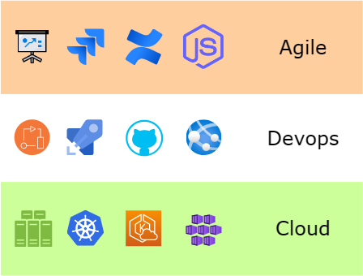

# 🛋️ The Agile, Cloud and Devops Lounge

## 🚀 Technical Overview

Astro looks for `.astro` or `.md` files in the `src/pages/` directory. Each page is exposed as a route based on its file name.

Any static assets, like images, can be placed in the `public/` directory.

All blog posts are stored in `src/content/blog` directory.

## 💻 Tech Stack

**Main Framework** - [Astro](https://astro.build/)
**Website Theme** - [AstroPaper](https://astro.build/themes/details/astro-paper/)
**Web Hosting** - [Cloudflare](https://www.cloudflare.com/)

## ✨ Get in touch

You can contact me via my [Linkedin](www.linkedin.com/in/nishadsaithaly)

## 📜 License

Licensed under the MIT License, Copyright © 2023

---

Made with 🤍 by [Nishad K S](https://nishad.link)
